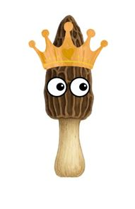

<!DOCTYPE html>
<html lang="fr">
<head>
<meta charset="UTF-8">
<meta name="viewport" content="width=device-width, initial-scale=1.0">
<title> 🍄 MeMorille 🍄</title>

</head>

<body>

<h1>Me_morille 🍄</h1>

Coups : 0

<button onclick="restartGame()">Recommencer</button>

<!-- IMAGE FINALE -->

    <h2>🌟 Maître des morilles 🌟</h2>
    

</body>
</html>
